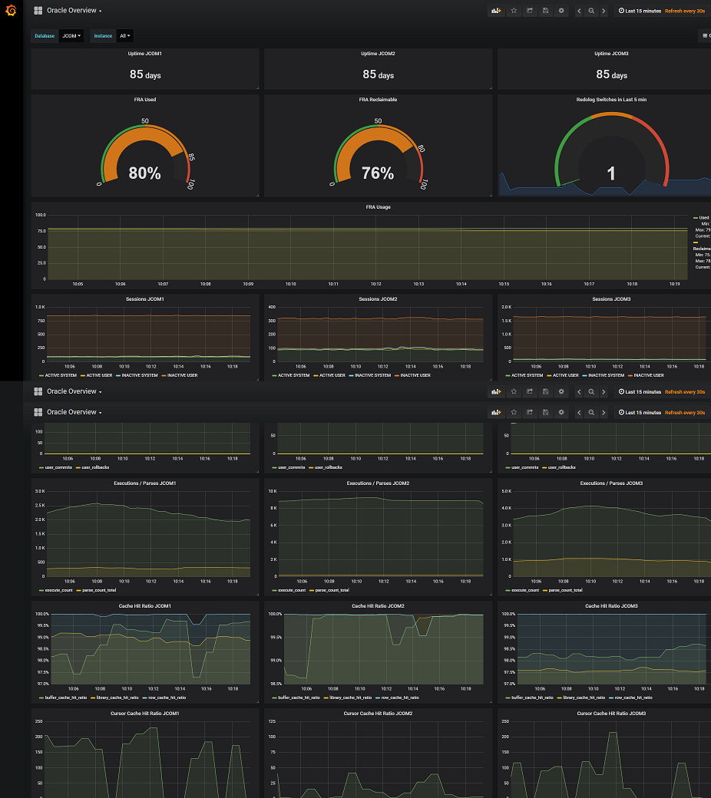
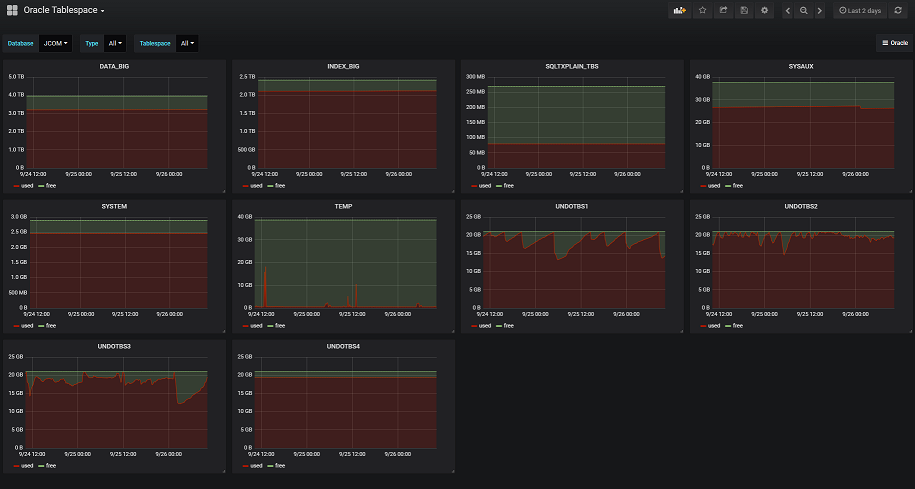
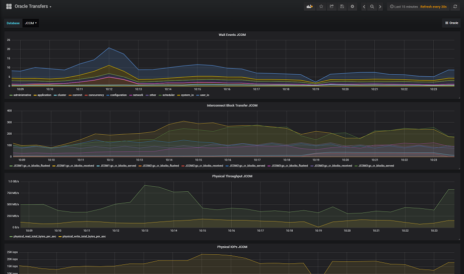
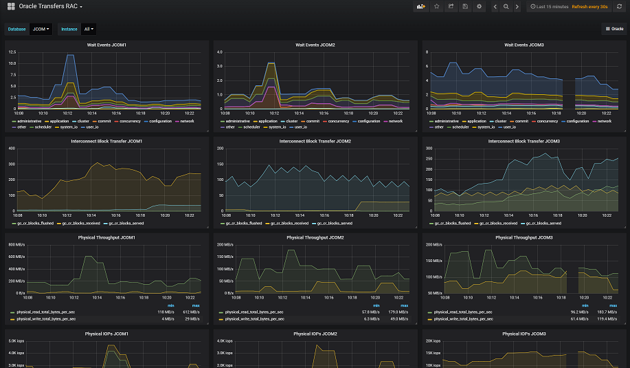
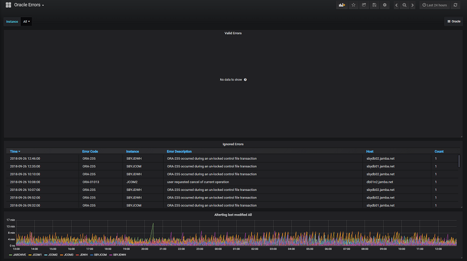

# Prometheus Oracle Exporter

A [Prometheus](https://prometheus.io/) exporter for Oracle.

The following metrics are exposed currently. Support for RAC (databasename and instancename added via lables)

- oracledb_exporter_last_scrape_duration_seconds
- oracledb_exporter_last_scrape_error
- oracledb_exporter_scrapes_total
- oracledb_uptime (days)
- oracledb_session (view v$session system/user active/passive)
- oracledb_sysmetric (view v$sysmetric
                  (Physical Read Total IO Requests Per Sec / Physical Write Total IO Requests Per Sec
                   Physical Read Total Bytes Per Sec / Physical Write Total Bytes Per Sec))
- oracledb_sysstat (view v$sysstat (parse count (total) / execute count / user commits / user rollbacks))
- oracledb_waitclass (view v$waitclass)
- oracledb_tablespace (tablespace total/free)
- oracledb_asmspace (Space in ASM (v$asm_disk/v$asm_diskgroup))
- oracledb_interconnect (view v$sysstat (gc cr blocks served / gc cr blocks flushed / gc cr blocks received))
- oracledb_redo (Redo log switches over last 5 min from v$log_history)
- oracledb_cachehitratio (Cache hit ratios (v$sysmetric)
- oracledb_up (Whether the Oracle server is up)
- oracledb_error (Errors parsed from the alert.log)
- oracledb_error_unix_seconds (Last modified Date of alert.log in Unixtime)
- oracledb_services (Active Oracle Services (v$active_services))
- oracledb_parameter (Configuration Parameters (v$parameter))

*TOOK VERY LONG, BE CAREFUL (Put the Metrics below in a separate Scrape-Config):
- oracledb_tablerows (Number of Rows in Tables)
- oracledb_tablebytes (Bytes used by Table)
- oracledb_indexbytes (Bytes used by Indexes of associated Table)
- oracledb_lobbytes (Bytes used by Lobs of associated Table)
- oracledb_recovery (percentage usage in FRA from V$RECOVERY_FILE_DEST)


The Oracle Alertlog file is scanned and the metrics are exposed as a gauge metric with a total occurence of the specific ORA.
You can define your own Queries and execute/scrape them

# Installation

Ensure that the configfile (oracle.conf) is set correctly before starting. You can add multiple instances, e.g. the ASM instance. It is even possible to run one Exporter for all your Databases, but this is not recommended. We use it in our Company because on one host multiple Instances are running.

**Custom metrics:**

You can add custom queries in config file for scraping (see field `queries` in [example](./oracle.conf.example)). The query identifier is `name` parameter. For each query you define columns for metrics (`metrics` parameter) and columns for labels (`labels` parameter).

Limitations:
1. If two queries contains different columns in `metrics` or `labels` parameter, then you need use different `name` for this queries (through the entire config file).
2. Mandatory params: `metrics`, `name`, `help`
3. Parameter `labels` is optional
4. Columns defined in `labels` parameter should be CHAR, VARCHAR or NUMBER type.
5. Columns defined in `metrics` parameter should be  NUMBER type.

Each defined query will provide a set of Prometheus metrics with a name `oracledb_custom_<query_name>` for every column defined in `metrics` parameter and for every row in query result. Column defined in `metrics` will appear in `metric` label.

Example:
```yaml
queries:
 - sql: "select 1 as column1, 2 as column2, 3 as label_column from dual"
   name: sample1
   help: "This is my metric number 1"
   metrics:
    - column1
    - column2
   labels:
    - label_column
```
If this query returns two rows then exporter will provide such set of metrics:
```
# HELP oracledb_custom_sample1 This is my metric number 1
# TYPE oracledb_custom_sample1 gauge
oracledb_custom_sample1{database="mydb",dbinstance="mydb",metric="column1",label_column="some value 1",rownum="1"} 3.14
oracledb_custom_sample1{database="mydb",dbinstance="mydb",metric="column1",label_column="some value 2",rownum="2"} 6.28
oracledb_custom_sample1{database="mydb",dbinstance="mydb",metric="column2",label_column="some value 1",rownum="1"} 1
oracledb_custom_sample1{database="mydb",dbinstance="mydb",metric="column2",label_column="some value 2",rownum="2"} 2
```


# Prometheus Configuration
```
scrape_configs:
  - job_name: 'oracle-short'
    metrics_path: /metrics
    static_configs:
      - targets:
        - oracle.host.com:9161
    relabel_configs:
     - source_labels: ['__address__']
       target_label: instance
       regex:  '(.*):\d+'
       replacement: "${1}"

  - job_name: 'oracle-tab'
    scrape_interval: 6h
    scrape_timeout: 120s
    metrics_path: /metrics
    params:
      tablerows: [true]
      lobbytes: [true]
      recovery: [true]
    static_configs:
      - targets:
         - oracle.host.com:9161
    relabel_configs:
     - source_labels: ['__address__']
       target_label: instance
       regex:  '(.*):\d+'
       replacement: "${1}"

  - job_name: 'oracle-ind'
    scrape_interval: 6h
    scrape_timeout: 120s
    metrics_path: /metrics
    params:
      tablebytes: [true]
      indexbytes: [true]
      recovery: [true]
    static_configs:
      - targets:
         - oracle.host.com:9161
    relabel_configs:
     - source_labels: ['__address__']
       target_label: instance
       regex:  '(.*):\d+'
       replacement: "${1}"
```

```bash
export NLS_LANG=AMERICAN_AMERICA.UTF8
/path/to/binary -configfile=/home/user/oracle.conf -web.listen-address :9161
```

## Usage

```bash
Usage of ./prometheus_oracle_exporter:
  -accessfile string
    Last access for parsed Oracle Alerts. (default "access.conf")
  -configfile string
    ConfigurationFile in YAML format. (default "oracle.conf")
  -defaultmetrics
    Expose standard metrics (default true)
  -indexbytes
    Expose Index size for any Table (CAN TAKE VERY LONG)
  -lobbytes
    Expose Lobs size for any Table (CAN TAKE VERY LONG)
  -logfile string
    Logfile for parsed Oracle Alerts. (default "exporter.log")
  -recovery
    Expose Recovery percentage usage of FRA (CAN TAKE VERY LONG)
  -tablebytes
    Expose Table size (CAN TAKE VERY LONG)
  -tablerows
    Expose Table rows (CAN TAKE VERY LONG)
  -web.listen-address string
    Address to listen on for web interface and telemetry. (default ":9161")
  -web.telemetry-path string
    Path under which to expose metrics. (default "/metrics")
```

# Grafana
In The folder [Grafana](https://grafana.com) are examples of my used Dashboards

## Overview


## Tablespace


## Transfers


## Transfers RAC


## Errors

